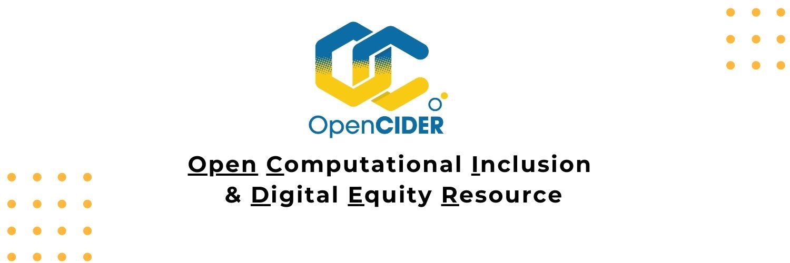

# OpenCIDER

## Welcome to [OpenCider](https://twitter.com/OpenCIDER), Open Computational Inclusion & Digital Equity Resource 

"_The Open Data handbook defines open data as data that can be freely used, re-used and redistributed by anyone - subject only, at most, to the requirement to attribute and share-alike."_ [_https://opendatahandbook.org/guide/en/what-is-open-data/_](https://opendatahandbook.org/guide/en/what-is-open-data/) __

To advance active participation in open data practices and to improve the quality of research, we need to adopt inclusive practices with particular attention to communities with limited resources to ensure equitable and effective engagement of underrepresented groups. 

To that end, OpenCIDER is a knowledge space where we highlight communities and resources related to several aspects under the umbrella of **Open Data** from a **global** perspective with a strong focus on Low-Middle Income countries \(**LMICs**\). 

We believe that enriching the Open Data community by propagating the foundations of equity, inclusion, sharing, and FAIRness on a **GLOBAL** scale, will provide significant benefits for research. It will also translate to more effective use of resources, increased rigor, transparency, re-use, participation, accountability, and reproducibility

## Check out our Handbook- Open for contributions!! 



To find out how to contribute to this resource, please see the full list of things we need help with on [get involved page](https://selgebali.gitbook.io/opencider/contact-us/get-involved).

#### Connect with us:



















[https://gitter.im/OpenCider/community](https://gitter.im/OpenCider/community)



## Latest:

Has the pandemic and shift to virtual events had a +ve or -ve impact on academic research in terms of attending conferences, workshops, and webinars? **Let's find out!!!** 

Please help us answer the following questions by filling in our **anonymous survey ~5 mins**: 

* Have more people participated in knowledge sharing events this year compared to last year? 
* Has the shift to online events had an effect on participation rates?
* What has helped people to participate?
* What challenges have deterred people from participating?
* Has gender, demographics, or other factors had an influence \(positive or negative\) on access to knowledge?


**Survey in English:** [ **https://shrtco.de/wPLJR** ](%20https://shrtco.de/wPLJR%20)\*\*\*\*

**Survey in Spanish:** [**https://shrtco.de/TAgokc**](https://shrtco.de/TAgokc)\*\*\*\*


